# Architecture & Planning

> Low-code/no-code desktop app for building, training, and visualizing neural networks via a sequential layer-builder UI — PyQt6 + PyTorch.

---

## Design Decisions

| # | Decision | Choice |
|---|---|---|
| 1 | Target column | Default last column, user can override via dropdown |
| 2 | Train/Val split | K-fold cross-validation support + percentage split |
| 3 | Loss & Optimizer | Smart selection based on problem type (classification / regression) |
| 4 | Batch size | User-configurable, default `32` |
| 5 | Layer types | Linear, Conv1d, MaxPool1d, AvgPool1d, Flatten, BatchNorm1d, Dropout |
| 6 | Problem type | UI toggle: classification vs. regression |
| 7 | UI layout | **3-window pipeline** (Data → Model → Training) |
| 8 | Theme | Dark theme |

---

## Directory Structure

```
neural-forge/
├── main.py                    # Entry point — launches Window 1
├── requirements.txt
│
├── ui/
│   ├── styles.py              # Dark theme QSS + palette
│   ├── window_data.py         # Window 1: Data loading & preprocessing
│   ├── window_model.py        # Window 2: Layer builder (sequential)
│   ├── window_training.py     # Window 3: Training, monitoring, eval (Phase 4)
│   ├── layer_row.py           # Custom widget: single layer row
│   ├── data_table_view.py     # QTableView wrapper for CSV preview
│   ├── plot_panel.py          # pyqtgraph loss-curve widget (Phase 5)
│   └── monitor_panel.py       # CPU / RAM / VRAM gauges (Phase 5)
│
├── backend/
│   ├── model_builder.py       # Blueprint → nn.Sequential + ghost run
│   ├── data_handler.py        # Pandas load/clean/split → tensors
│   └── exporter.py            # ONNX export
│
├── workers/
│   └── training_worker.py     # QThread + pyqtSignals
│
├── utils/
│   ├── project_state.py       # Shared state across all windows
│   ├── blueprint_io.py        # JSON save / load
│   └── validators.py          # Blueprint & data validation
│
├── tests/
│   ├── test_phase1.py
│   ├── test_phase2.py
│   └── test_phase3.py
│
└── docs/
    ├── architecture.md        # This file
    ├── walkthrough_phase1.md  # Phase 1 code walkthrough
    ├── walkthrough_phase2.md  # Phase 2 code walkthrough
    └── walkthrough_phase3.md  # Phase 3 code walkthrough
```

---

## 3-Window Pipeline

```mermaid
flowchart LR
    subgraph W1 ["Window 1 — Data"]
        CSV["Load CSV"]
        Preview["Table Preview"]
        Target["Target Column Picker"]
        Split["Split Config"]
        ProbType["Problem Type"]
    end

    subgraph W2 ["Window 2 — Model"]
        Builder["Layer Builder"]
        SaveLoad["Save / Load JSON"]
        Ghost["Ghost Run Validation"]
    end

    subgraph W3 ["Window 3 — Training"]
        Hyper["Hyperparams"]
        LossOpt["Loss & Optimizer"]
        Device["Device Toggle"]
        Plot["Loss Curve"]
        Monitor["Resource Monitor"]
        Export["ONNX Export"]
    end

    W1 -- "DataFrame + metadata" --> W2
    W2 -- "nn.Sequential + blueprint" --> W3
```



### Window Transitions

Each window has a **"Next →"** button that validates its state before opening the next window, and a **"← Back"** button to return. A shared `ProjectState` dataclass carries data forward:

```python
@dataclass
class ProjectState:
    dataframe: pd.DataFrame | None
    target_column: str
    problem_type: str            # "classification" | "regression"
    split_config: dict           # {"method": "percentage", "ratio": 0.8}
    blueprint: list[dict]        # layer configs
    model: nn.Module | None
    dummy_tensor: torch.Tensor | None
    hyperparams: dict            # lr, epochs, batch_size
    device: str                  # "cpu" | "cuda" | "mps"
```

---

## Smart Loss & Optimizer Selection

When the user picks **Classification** or **Regression** in Window 1, the dropdowns in Window 3 auto-filter:

| Problem Type | Available Losses | Available Optimizers |
|---|---|---|
| Classification | `CrossEntropyLoss`, `BCEWithLogitsLoss`, `NLLLoss` | `Adam`, `AdamW`, `SGD` |
| Regression | `MSELoss`, `L1Loss`, `SmoothL1Loss` | `Adam`, `AdamW`, `SGD` |

---

## Blueprint Format

Each layer type has its own schema:

```json
[
  {"type": "Conv1d", "out_channels": 32, "kernel_size": 3, "stride": 1, "padding": 1},
  {"type": "MaxPool1d", "kernel_size": 2, "stride": 2},
  {"type": "Flatten"},
  {"type": "Linear", "neurons": 128, "activation": "ReLU"},
  {"type": "BatchNorm1d"},
  {"type": "Dropout", "rate": 0.3},
  {"type": "Linear", "neurons": 10, "activation": "None"}
]
```

| Layer Type | Fields |
|---|---|
| `Linear` | `neurons`, `activation` |
| `Conv1d` | `out_channels`, `kernel_size`, `stride`, `padding` |
| `MaxPool1d` | `kernel_size`, `stride` |
| `AvgPool1d` | `kernel_size`, `stride` |
| `Flatten` | *(none)* |
| `BatchNorm1d` | *(none)* |
| `Dropout` | `rate` |

---

## Default Hyperparameters

| Param | Default | UI Control |
|---|---|---|
| Learning Rate | `0.001` | `QDoubleSpinBox` |
| Epochs | `50` | `QSpinBox` |
| Batch Size | `32` | `QSpinBox` |

---

## Core Dependencies

| Package | Purpose |
|---|---|
| `PyQt6 >= 6.6` | GUI framework |
| `torch >= 2.2` | Neural network engine |
| `pandas >= 2.1` | CSV loading and cleaning |
| `pyqtgraph >= 0.13` | Real-time loss plot |
| `psutil >= 5.9` | CPU / RAM monitoring |
| `scikit-learn >= 1.4` | K-fold splitting, metrics |
| `onnx >= 1.15` | ONNX model validation (optional) |

---

## Verification Plan

| Phase | Automated Test | Manual Check |
|---|---|---|
| 1 | `test_phase1.py` — layers, architecture, JSON save/load | Dark theme renders, layer rows respond |
| 2 | `test_phase2.py` — CSV load, NaN handling, split | Table preview, bad CSV shows error |
| 3 | `test_phase3.py` — blueprint → model, ghost run | Mismatch triggers friendly error |
| 4 | `test_phase4.py` — worker signals, stop flag | Training doesn't freeze UI |
| 5 | `test_phase5.py` — ONNX export | Loss curve updates live |
