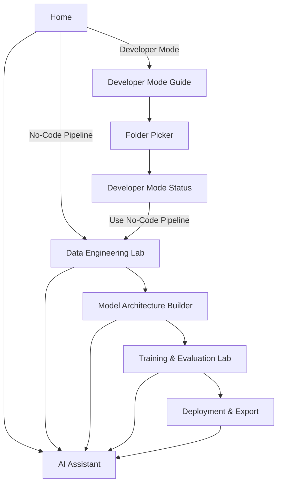

# Architecture

> Neural Forge is a PyQt6 + PyTorch desktop app with a no-code neural-network pipeline, a Developer Mode project-import path, and an NVIDIA-backed AI Assistant.

---

## Top-Level Design

The application has a single `QMainWindow` (`NeuralForgeApp`) with a persistent sidebar and a central `QStackedWidget`.


```mermaid
flowchart TB
    Home["Home"]
    Data["Data Engineering Lab"]
    Model["Model Architecture Builder"]
    Train["Training & Evaluation Lab"]
    Export["Deployment & Export"]
    DevGuide["Developer Mode Guide"]
    DevImport["Folder Picker"]
    DevStatus["Developer Mode Status"]
    Assistant["AI Assistant"]

    Home -- "No-Code Pipeline" --> Data
    Data --> Model
    Model --> Train
    Train --> Export
    Home -- "Developer Mode" --> DevGuide
    DevGuide --> DevImport
    DevImport --> DevStatus
    DevStatus -- "Use No-Code Pipeline" --> Data
    Home --> Assistant
    Data --> Assistant
    Model --> Assistant
    Train --> Assistant
    Export --> Assistant
```

Developer Mode validates a code project folder and preserves the imported project path. The AI Assistant can use the current project state as context, but it does not execute training or mutate project files.

---

## Runtime State

`utils.project_state.ProjectState` is the shared mutable state passed to each screen.

```python
dataframe: pd.DataFrame | None
target_column: str
problem_type: str              # "classification" | "regression"
pipeline: Any                  # preprocessing DataPipeline
split_config: dict             # percentage/kfold + optional resampling
blueprint: list[dict]
model: Any                     # nn.Module after build/ghost run
dummy_tensor: Any              # export trace input
hyperparams: dict              # lr, epochs, batch_size
device: str                    # "cpu" | "cuda" | "mps"
loss_fn_name: str
optimizer_name: str
dev_project_path: str
```

---

## Directory Structure

```text
neural-forge/
├── main.py
├── requirements.txt
├── assets/
├── backend/
│   ├── assistant_client.py
│   ├── data_handler.py
│   ├── exporter.py
│   ├── model_builder.py
│   └── training_config.py
├── docs/
├── tests/
├── ui/
│   ├── custom_toggle.py
│   ├── data_table_view.py
│   ├── layer_row.py
│   ├── monitor_panel.py
│   ├── plot_panel.py
│   ├── styles.py
│   ├── window_assistant.py
│   ├── window_data.py
│   ├── window_export.py
│   ├── window_model.py
│   ├── window_project_guide.py
│   └── window_training.py
├── utils/
└── workers/
    ├── assistant_worker.py
    ├── data_loader_worker.py
    └── training_worker.py
```

---

## No-Code Pipeline

1. **Data Engineering Lab** loads CSV/Parquet files, profiles data, applies cleaning/feature engineering/preprocessing, and stores the processed dataframe plus `DataPipeline`.
2. **Model Architecture Builder** builds a sequential blueprint, locks the output layer to the current problem type, validates the blueprint, and materializes a PyTorch model with a ghost run.
3. **Training & Evaluation Lab** trains the model in a `QThread`, plots losses and classification metrics, and computes final evaluation metrics.
4. **Deployment & Export** exports the preprocessing pipeline, PyTorch model state dict, or ONNX model.

---

## Developer Mode

Developer Mode uses `ui.window_project_guide.ProjectGuideDialog` to explain required project structure, then imports a folder path and checks for:

| Required | Optional |
|---|---|
| `model.py` | `loss.py` |
| `dataset.py` | `metrics.py` |
| `config.yaml` | `checkpoints/`, `logs/` |

The import path is stored as `ProjectState.dev_project_path`.

---

## AI Assistant

The assistant tab uses `ui.window_assistant.AssistantWindow` for the chat UI and `workers.assistant_worker.AssistantWorker` for background streaming. The backend client lives in `backend.assistant_client` and talks to NVIDIA's OpenAI-compatible endpoint.

Configuration is read from environment variables, usually through a local `.env` file:

| Variable | Purpose |
|---|---|
| `NVIDIA_API_KEY` | Required API key for NVIDIA hosted models |
| `NVIDIA_BASE_URL` | API base URL, defaults to `https://integrate.api.nvidia.com/v1` |
| `NVIDIA_ASSISTANT_MODEL` | Chat model, defaults to `nvidia/nemotron-mini-4b-instruct` |
| `NVIDIA_ASSISTANT_TIMEOUT_SECONDS` | Request timeout, defaults to `20` |
| `NVIDIA_ASSISTANT_MAX_TOKENS` | Response token budget, defaults to `1024` |
| `NVIDIA_ASSISTANT_ENABLE_THINKING` | Enables provider reasoning chunks when set to `true`; defaults to `false` for faster chat |

The assistant receives a compact project summary generated from `ProjectState`: dataset status, target, problem type, split configuration, blueprint layers, training settings, export readiness, and Developer Mode path. It does not receive full dataset contents.

---

## Backend Boundaries

Backend modules do not import PyQt6:

| Module | Responsibility |
|---|---|
| `backend/assistant_client.py` | NVIDIA API settings, project context summary, streaming chat responses |
| `backend/data_handler.py` | Loading, profiling, cleaning, feature engineering, preprocessing, splitting |
| `backend/model_builder.py` | Blueprint translation and ghost-run validation |
| `backend/training_config.py` | Loss/optimizer registries |
| `backend/exporter.py` | ONNX export |

Long-running work is delegated to workers:

| Worker | Purpose |
|---|---|
| `AssistantWorker` | Streams chat responses off the UI thread |
| `DataLoaderWorker` | Runs data operations off the UI thread |
| `TrainingWorker` | Runs PyTorch training and evaluation off the UI thread |

---

## Core Dependencies

| Package | Purpose |
|---|---|
| `PyQt6` | Desktop UI |
| `torch` | Model building and training |
| `numpy`, `pandas`, `pyarrow` | Data loading and preprocessing |
| `scikit-learn`, `imbalanced-learn` | Splits, metrics, preprocessing, optional resampling |
| `pyqtgraph` | Live plots |
| `psutil` | CPU/RAM monitoring |
| `onnx` | ONNX export validation |
| `openai`, `python-dotenv` | NVIDIA AI Assistant API client and local environment loading |

---

## Verification

Run the full test suite after installing dependencies:

```bash
python -m pytest tests -q
```

Run syntax checks without importing optional runtime packages:

```bash
python -m py_compile main.py backend/*.py ui/*.py utils/*.py workers/*.py
```
