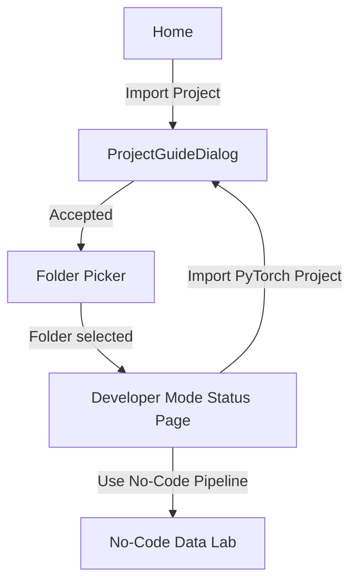

# Developer Mode Walkthrough

> Import an existing PyTorch project folder and validate that it follows Neural Forge's expected structure.

---

## Current Scope

Developer Mode is an import and validation workflow. It does not yet execute the imported code, open a code editor, or train a user-supplied project. Those integration points are intentionally left out of the production-ready no-code release.

---

## User Flow



The sidebar also exposes Developer Mode. If no folder has been imported yet, clicking that sidebar item starts the same guide and folder-picker flow.

---

## Files

| File | Purpose |
|---|---|
| [`main.py`](../main.py) | Home cards, Developer Mode status page, folder-picker flow |
| [`ui/window_project_guide.py`](../ui/window_project_guide.py) | Modal onboarding dialog that explains required project structure |
| [`utils/project_state.py`](../utils/project_state.py) | Stores `dev_project_path` |

---

## Required Project Structure

```text
my_project/
├── model.py        # REQUIRED: nn.Module architecture
├── dataset.py      # REQUIRED: data loading / dataset code
├── config.yaml     # REQUIRED: UI/script configuration bridge
├── loss.py         # OPTIONAL: custom losses
├── metrics.py      # OPTIONAL: custom metrics
├── checkpoints/    # OPTIONAL: saved weights
└── logs/           # OPTIONAL: run logs
```

`ProjectGuideDialog` teaches these conventions before the user imports a folder. The user can suppress the dialog using the "Don't show again" checkbox, which writes to `QSettings("NeuralForge", "NeuralForge")` under `developer_mode/skip_guide`.

---

## Status Page

`DevProjectWindow` is defined in `main.py`. After import it:

- Displays the selected folder path.
- Checks required files: `model.py`, `dataset.py`, `config.yaml`.
- Checks optional files/folders: `loss.py`, `metrics.py`, `checkpoints`, `logs`.
- Shows a green ready message only when all required files exist.
- Keeps "Continue to Training" disabled because code-first training execution is not implemented yet.

---

## Config Bridge Convention

Future Developer Mode execution should use `config.yaml` as the UI-to-script bridge:

```yaml
learning_rate: 0.001
batch_size: 32
optimizer: Adam
epochs: 50
```

User project scripts should read this file instead of hardcoding hyperparameters:

```python
import yaml

cfg = yaml.safe_load(open("config.yaml", encoding="utf-8"))
lr = cfg["learning_rate"]
```
