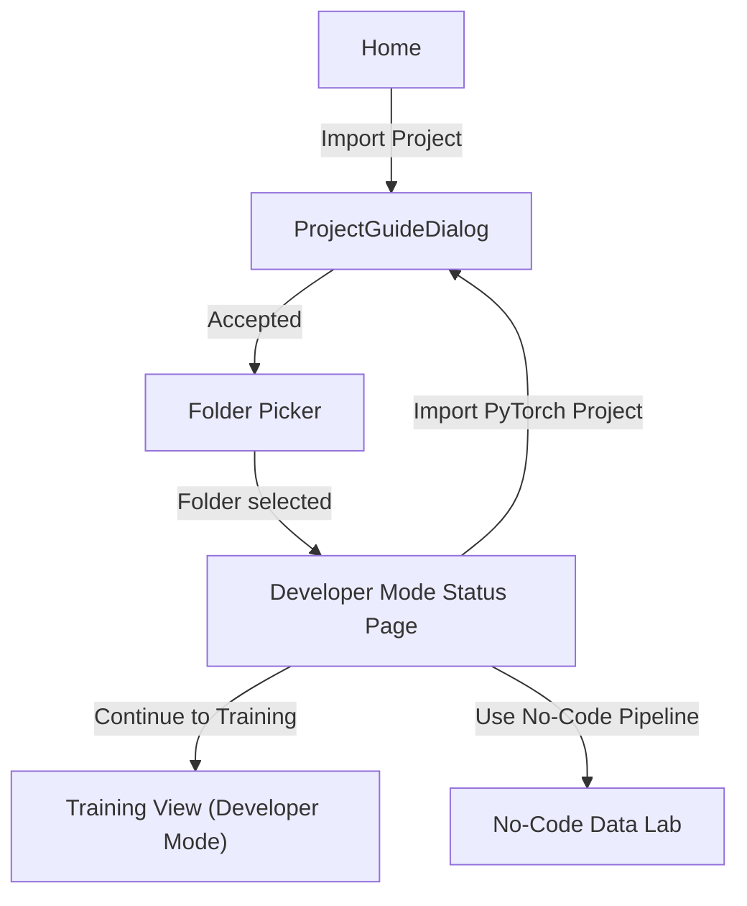

# Developer Mode Walkthrough

> Import an existing PyTorch project folder and validate that it follows Neural Forge's expected structure.

---

## Current Scope

Developer Mode imports and validates an existing PyTorch project folder. When the required files are present, it can hand the project to the shared Training view in Developer Mode.

The current integration does not open a code editor or perform static AST validation in the main flow. It uses the status page in `main.py`, then launches `backend.dev_trainer.DevTrainer` from `ui.window_training.TrainingWindow`. Developer Mode also starts `backend.hardware_monitor.HardwareMonitor` for the hardware dashboard and GPU-temperature thermal guard.

---

## User Flow



The sidebar also exposes Developer Mode. If no folder has been imported yet, clicking that sidebar item starts the same guide and folder-picker flow.

---

## Files

| File | Purpose |
|---|---|
| [`main.py`](../main.py) | Home cards, Developer Mode status page, folder-picker flow |
| [`ui/window_training.py`](../ui/window_training.py) | Developer Mode branch inside the shared Training view |
| [`ui/window_training_dev.py`](../ui/window_training_dev.py) | Developer Mode hardware dashboard widgets |
| [`ui/window_project_guide.py`](../ui/window_project_guide.py) | Modal onboarding dialog that explains required project structure |
| [`backend/dev_trainer.py`](../backend/dev_trainer.py) | QThread-based user-project training scaffold |
| [`backend/hardware_monitor.py`](../backend/hardware_monitor.py) | QThread-based GPU/CPU/RAM monitor for Developer Mode |
| [`utils/config_schema.py`](../utils/config_schema.py) | Serializable configuration object used by the Developer Mode trainer |
| [`utils/project_state.py`](../utils/project_state.py) | Stores `dev_project_path` and `training_mode` |

Scaffold file present but not wired into `NeuralForgeApp`:

| File | Purpose |
|---|---|
| [`ui/window_project_validation.py`](../ui/window_project_validation.py) | Static AST validation screen scaffold for checking required functions |

---

## Required Project Structure

```text
my_project/
├── model.py        # REQUIRED: nn.Module architecture
├── dataset.py      # REQUIRED: data loading / dataset code
├── config.yaml     # REQUIRED: UI/script configuration bridge
├── loss.py         # OPTIONAL: custom losses
├── metrics.py      # OPTIONAL: custom metrics
├── checkpoints/    # OPTIONAL: saved weights
└── logs/           # OPTIONAL: run logs
```

`ProjectGuideDialog` teaches these conventions before the user imports a folder. The user can suppress the dialog using the "Don't show again" checkbox, which writes to `QSettings("NeuralForge", "NeuralForge")` under `developer_mode/skip_guide`.

---

## Status Page

`DevProjectWindow` is defined in `main.py`. After import it:

- Displays the selected folder path.
- Checks required files: `model.py`, `dataset.py`, `config.yaml`.
- Checks optional files/folders: `loss.py`, `metrics.py`, `checkpoints`, `logs`.
- Shows a green ready message only when all required files exist.
- Enables "Continue to Training" when all required files exist.
- Sets `ProjectState.training_mode` to `"dev"` and opens the Training view.

`ProjectValidationWindow` uses a stricter function-contract check (`build_model`, `build_dataloaders`, optional `build_criterion`, optional `compute_metrics`) and treats `config.yaml` as optional. That is not the active `main.py` flow, whose status page checks only the file/folder names listed above.

---

## Training Contract

Developer Mode training currently expects these runtime hooks:

| File | Required hook |
|---|---|
| `model.py` | `get_model(config: dict) -> torch.nn.Module` |
| `dataset.py` | `get_dataloader(config: dict, split: str) -> DataLoader` |
| `loss.py` | Optional `get_loss(config: dict) -> torch.nn.Module` |
| `metrics.py` | Optional `get_metrics(config: dict) -> dict[str, callable]` |

If `loss.py` or `metrics.py` is absent, built-in defaults are used for `classification` and `segmentation` tasks.

The hardware dashboard is Developer Mode only. No-code training keeps using the existing no-code configuration panels, top-right resource text, `TrainingWorker`, and plot flow.

---

## Config Bridge Convention

Developer Mode training reads `config.yaml` through `utils.config_schema.DevProjectConfig`:

```yaml
learning_rate: 0.001
batch_size: 32
optimizer: Adam
epochs: 50
auto_pause_temp: 90
resume_temp: 80
```

User project scripts should read this file instead of hardcoding hyperparameters:

```python
import yaml

cfg = yaml.safe_load(open("config.yaml", encoding="utf-8"))
lr = cfg["learning_rate"]
```
